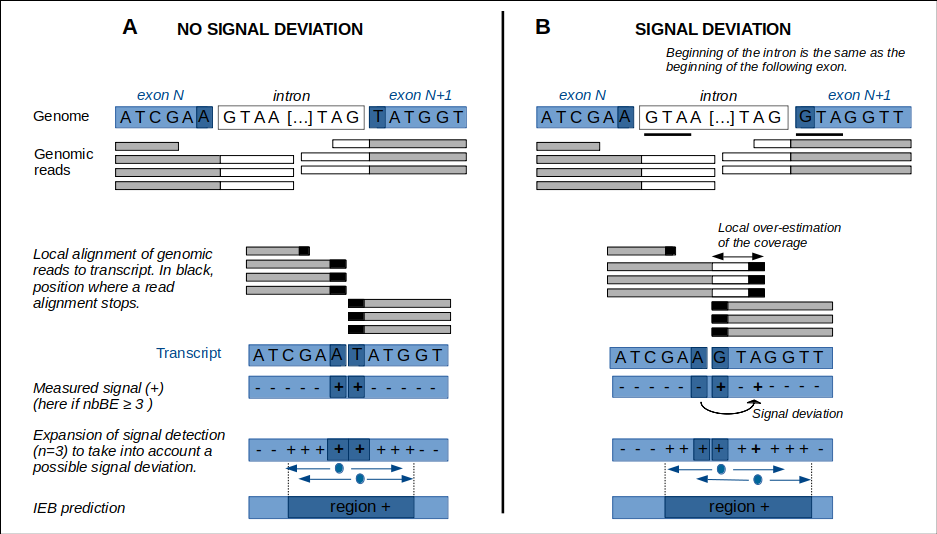
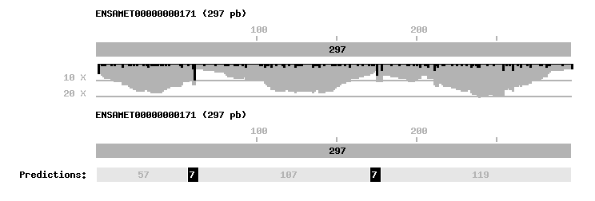

# IEB_finder #

Predicts Intron-Exon Boundaries (IEB) on *de novo* transcript sequences using result of mapping genomic reads directly onto coding sequences (CDS). Tool principle is described in the Deleury et al. 2019 (doi:[10.1101/583534](https://doi.org/10.1101/583534)).


## *Description*

These scripts allow the identification of Intron-Exon Boundaries (IEB) on transcript sequences as described in Deleury et al. 2019 (doi:[10.1101/583534](https://doi.org/10.1101/583534)). Briefly, the method is based solely on the direct mapping of __genomic reads__ to __the CDS sequences__, by allowing reads to map over less than their full length (i.e. local alignment). Thus, a genomic read with both part of an exon and its flanking sequences (intron or UTR) will start mapping to the corresponding exon in the CDS sequence, and stop mapping at the exon end ([Conklin et al. 2013](http://www.ehu.eus/cs-ikerbasque/conklin/papers/iwbbio13.pdf)). This will result in the generation of a particular signal if we focus, for a given position, on the number of reads that either begin or end their local alignment at that position (hereafter referred to as *nbBE*). Along a covered exon, *nbBE* should be much lower than the coverage rate, except at the end of the exon, where we should observe a large increase in *nbBE* to a value theoretically equal to the coverage (Fig. 1A). This strong increase in *nbBE* should occur either at the base at the exact end of the exon (Fig. 1A), or a few bases away if the start of the intron sequence is, by chance, highly similar to the start of the next exon sequence on the CDS (Fig. 1B). In this second case, it creates an abnormally inflated estimate of coverage locally for a few bases at the boundary of the following exon.




*Figure 1: Schematic representation of the method*


At each position in the transcript, *nbBE* is calculated. The value of the *nbBE* parameter at each position is a function of coverage (and read length). We take the possible effect of coverage heterogeneity on *nbBE* into account by calculating the median nbBE over a window of 11 bases centered on the position concerned (not shown in simplified Figure 1). A signal,i.e. a predicted IEB, is detected at a position if *nbBE* is *X* times larger than the median, *X* being a tool parameter defined by the user. Signals at the exact ends of the CDS are not considered. We take the possible signal deviation (Fig. 1B) into account, by extending signal detection to the three bases upstream, and three bases downstream from a position with measured signal (default value for parameter *n*=3). A measured signal therefore predicts an IEB in a window of seven bases in total. An IEB, composed of two exon ends, theoretically generates two close signals with overlapping windows. If these two signals are found at the exact positions of the exon ends (no deviation), then the predicted region measures 8 bp (Fig. 1A). If these two signals overlap (deviation from one of the signals to the other) then the predicted region for the IEB is 7 bp long (not shown). If these signals deviate by up to six bases from each other (i.e. cumulative deviation of eight bases, the deviation being in opposite directions for the two signals) then the predicted region measures 14 bp (in the example in Fig. 1B, signal deviation of 3 bp and a predicted region of 9 bp). If the two signals deviate by more than six bases from each other, then the tool predicts two signal windows separated by a few bases for the IEB concerned. Thus, each transcript was divided into short regions with prediction signals (+) alternating with regions without prediction signals (-).


Briefly, the scripts must be run in three steps (in addition to the read alignment step):

* **Step 1:** Preparation of CDS sequences. In case you know the IE structure of the CDS (GFF file available) and you want to evaluate the method, this step allows you to check the correct correspondence between the fasta files of the CDS and the GFF3 file.
* **Step 2:** Alignment of genomic reads on CDS sequences by allowing the reads not to align over its entire length.
* **Step 3:** Formatting of mapping results for each CDS.
* **Step 4:** Prediction of IEBs on covered CDSs.

We propose an additional script to graphically visualize on one particular CDS the available data (coverage, *nbBE*), IE structure if known, result of the IEB prediction. This can help to analyze why an IEB is not predicted in case you know the IE structure of the CDS for example.


## *Requierements*

- perl 5 with the packages : `Getopt::Long`, `Statistics::Descriptive`, `libgd-perl` (optionnal)
- for the read alignment step we propose to use `[BOWTIE2](http://bowtie-bio.sourceforge.net/bowtie2/manual.shtml)` and `[samtools](http://samtools.sourceforge.net/)`


## *Usage*

#### Step 1 :  collect_CDS_infos.pl

This script calculates the length of each CDS sequence. If the intron-exon structure of CDS is known (GFF file available), the script checks the correct correspondence of the information contained in the GFF file with CDS in fasta format. Alert messages will be returned if this is not the case. It may then be necessary to adapt your CDS sequences (to ensure a correct evaluation of the prediction method). Type `perl collect_CDS_infos.pl -h` to show the help message:


```
USAGE : perl collect_CDS_infos.pl -f <CDS.fasta> [-g <gff3>] [-h] -o <output.csv>

Collect CDS information  : CDS lengths and, if intron-exon structure is known (GFF available), exon positions on CDS sequence. Probably must be adapted for each GFF file (different nomage according to the species).

arguments:
  -f	  fasta file of CDS sequences
  -o	  output file

optional arguments:
  -h	  show the help message
  -g	  GFF file with intron-exon gene features
```


*Example 1:* This command creates a file with the length of the CDS.


```
export WORKDIR=/path_where_you_installed_the_tool/IEB-finder
cd $WORKDIR/data/test/cds/
grep -c '^>' test.fa  # 6 CDS
# prepare CDS without intron-exon structure (no GFF file)
perl $WORKDIR/bin/collect_CDS_infos.pl -f test.fa -o test.csv
head -3 test.csv
#   ACCESSION		LGTH
#	ENSAMET00000000122	1014
#	ENSAMET00000000154	1818
```


*Example 2:* This command creates a file with the length of the CDS and the exon positions on CDS sequences. To be used in case you want to evaluate the effectiveness of prediction with IEB_predictor. A warning message is returned when the cumulative length of the exons of one CDS (in GFF file) is different from the length of the CDS sequence (in fasta file). It is important to check the correct correspondence of the GFF file with the CDS fasta file (in particular the exact correspondence of sequence accessions).

```
# prepare CDS with intron-exon structure (GFF file)
perl $WORKDIR/bin/collect_CDS_infos.pl -f test.fa -g test.gff3 -o test.csv
head -3 test.csv
#   ACCESSION	LGTH	EXON_POSITIONS
#   ENSAMET00000000122	1014	1-201;202-376;377-522;523-636;637-747;748-1014;
#   ENSAMET00000000154	1818	1-106;107-226;227-325;326-1369;1370-1818;
```


#### Step 2 : Mapping genomic reads on CDS sequences


Genomic reads must be aligned on CDS sequences by allowing the reads not to align over its entire length with your favorite mapper. For example, here we give the command lines using BOWTIE2 (Langmead et al. 2012) with the *local* option. The *genomicReads.fq* is not provided. Only the output alignment file is provided for the rest of our example.


*Example of mapping with BOWTIE2:*

```
cd $WORKDIR/data/test/mapping/
# create bowtie2 index database (database name: CDS)
bowtie2-build  ../cds/test.fa  CDS
# bowtie2 mapping: genomic reads to CDS database
bowtie2 --local --no-unal -x CDS -U genomicReads.fq -S bowtie2_align.sam
# to know the number of CDS covered by at least one read
perl $WORKDIR/bin/sup/qd_count_nbreads_per_ref.pl  bowtie2_align.sam
wc -l NbReadsPerTargets.csv   # 6 covered CDS
# for the next step, the sam file must be sorted
samtools view -bS -o bowtie2_align.bam bowtie2_align.sam
samtools  sort  bowtie2_align.bam  bowtie2_align.sorted
samtools view -h -o bowtie2_align.sorted.sam bowtie2_align.sorted.bam
# clean
rm bowtie2_align.sam bowtie2_align.bam bowtie2_align.sorted.bam CDS.*
```

*Note*: For the rest of our example, you can use this sorted BAM file : `$WORKDIR/data/test/mapping/bowtie2_align.sorted.bam`.


#### Step 3 : sam2eachpos_perCDS.pl


This script creates a directory per covered CDS in the output directory specified by the user. For each CDS, it rewrites a SAM file with all the reads that map to the CDS, then transforms it into an `eachpos` file. This `eachpos` file lists a number of features at each CDS position. A line in the file corresponds to a CDS position, it indicates (i) if the position is an exon end (*EE*=1 otherwise 0, 0 at all positions if the CDS IE structure is unknown), (ii) the number of reads that map to that position (*COV*), (iii) the number of reads that start or end mapping (*nbBE*). It is this file that will be analyzed by the predictor in step 4.  Type `perl sam2eachpos_perCDS.pl -h` to show the help message:


```
USAGE : perl sam2eachpos_perCDS.pl [-h] -i <CDSinfos> -s <SAM> -o <dir_output>

arguments:
  -i	  CDS information file (step1 output)
  -s	  SAM file, output of mapping genomic reads on CDS sequences (local alignments; step2)
  -o	  output directory

optional arguments:
  -h	  show the help message
```


*Example:*

```
cd $WORKDIR/data/test/
# create output directory
mkdir predieb
# extraction of information from individual sam
perl $WORKDIR/bin/sam2eachpos_perCDS.pl -i cds/test.csv -s mapping/bowtie2_align.sorted.sam -o predieb
# output: as many directories as CDSs covered
ls predieb/
#   ENSAMET00000000122
#   ENSAMET00000000154
#   ENSAMET00000000164
#   ENSAMET00000000171
#   ENSAMET00000000184
#   ENSAMET00000000316
ls | grep csv
#   CDS_STATS_.csv # some statistics on coverage and nbBE du CDS
# output: for each covered CDS, creation of an eachpos file
vim predieb/ENSAMET00000000122/eachpos
#   REF     POS     EE      COV     nbBE
#   #ENSAMET00000000122 LGTH=1014 EXONS=1-201;202-376;377-522;523-636;637-747;748-1014
#   ENSAMET00000000122      1       1       1       1 # CDS end
#   ENSAMET00000000122      2       0       2       1
#   ENSAMET00000000122      3       0       2       0
#   [...]
#   ENSAMET00000000122      373     0       4       0
#   ENSAMET00000000122      374     0       4       0
#   ENSAMET00000000122      375     0       4       0
#   ENSAMET00000000122      376     1       6       6 # exon end
#   ENSAMET00000000122      377     1       5       3 # exon end
#   ENSAMET00000000122      378     0       6       1
#   ENSAMET00000000122      379     0       6       0
#   ENSAMET00000000122      380     0       6       0
#   [...]
#   ENSAMET00000000122      1013    0       3       0
#   ENSAMET00000000122      1014    1       3       3 # CDS end
```


#### Step 4 : IEB_predict.pl


For each CDS present in the directory indicated in the input, the script performs the IEB positions prediction as described in the Deleury et al. 2019 methods (doi: 10.1101/583534). If the IE structure of CDS is known, an assessment of the predictions can be calculated with option `-e 1` (default `-e 0`). Type `perl IEB_predict.pl -h` to show the help message:


```
USAGE : IEB_predict.pl [-h] [...] -d <DIR_ALL_COVERED_CDS> -x <cutoff_toDetectSignal>

arguments:
  -c	  Minimum coverage to predict IEB (default: 10)
  -d	  Directory with covered CDS to annote (defined in step 3, ie output directory for all CDS)
  -l	  Minimum region length with coverage < c to consider a region not covered (default: 10)
    	  A region is considered not covered if it has more than x consecutive bases with a coverage below c.
  -w1	  Number of bases to be taken from each side of a position to calculate the median of the nbBE
    	  in this window (default: 5 for a window of 11 bases centered on the position)
  -x	  Cutoff to detect a signal. A signal is detected at a position if nbBE at that position is x times larger
    	  than the local median of nbBE.
  -n	  Number of bases on which the signal is extended on either side of the measured signal (default: 3)
  -e	  Evaluation of the predicter's performance (-e 1), IE structure of CDS need to be known (default: 0)

optional arguments:
  -h	  show the help message

```


*Example:*

```
cd $WORKDIR/data/test/
# prediction of IEB
perl $WORKDIR/bin/IEB_predict.pl -e 1 -c 4 -d predieb -x 5
# outputs
ls | grep 'csv'
#   evaluation_allCDS_c4_x5_n3.csv # evaluation if CDS with known intron-exon structure
#   regions_allCDS_c4_x5_n3.csv # prediction of the IE structure for all covered CDS # only if "-e 1"
vim regions_allCDS_c4_x5_n3.csv
#   ## file extract for the CDS ENSAMET00000000171
#   ACC     NUM     BEGIN-END       LGTH    MEAN_COV        SIGNAL_NB       PREDICTION      PRED    EVAL
#   #ENSAMET00000000171 LGTH=297 EXONS=1-61;62-175;176-297 COV_MEAN=12.0 MEDIAN_nbBE=0
#   ENSAMET00000000171      1       1-57    57      ENSAMET00000000171      0       EXON    -       TN
#   ENSAMET00000000171      -       58-64   7       ENSAMET00000000171      1       IEB     +       TP
#   ENSAMET00000000171      2       65-171  107     ENSAMET00000000171      0       EXON    -       TN
#   ENSAMET00000000171      -       172-178 7       ENSAMET00000000171      1       IEB     +       TP
#   ENSAMET00000000171      3       179-297 119     ENSAMET00000000171      0       EXON    -       TN
vim evaluation_allCDS_c4_x5_n3.csv   # only if "-e 1" and known IE structure
#   ## file extract: evaluation of prediction for the CDS ENSAMET00000000171
#   #CDS    LGTH    LGTH_covered    COV_MEAN        COV_MEAN_covered        med_nbBE        NbRegCov0       nbIEB   nbIEBcov        TP      FN      FP      TN      SN      SP
#   ENSAMET00000000171      297     297     12.0    12.0    0       0       2       2       2       0       0       3       100.00  100.00
# detailed output in the directory of each CDS (file name according to some script parameters)
vim predieb/ENSAMET00000000171/ENSAMET00000000171_eachpos__IEBpred_c4_x5_n3.csv

```

#### Script to graphically visualize predictions


In some cases, it may be interesting to visualize as an image the features along the CDS sequence (coverage, nbBE) and the IEB predictions obtained. The script `qd_make_img_img_1_transcrit.pl` allows to build this image. Type `perl qd_make_img_1_transcrit.pl -h` to show the help message:


```
USAGE : qd_make_img_1_transcrit.pl [options] -i <EACHPOS> -t <CDS_accession>

arguments:
  -i	  Input file in eachpos format (with or without predictions)
  -t	  CDS/transcript accession

optional arguments:
  -h	  Show the help message

```


*Example:*

```
cd $WORKDIR/data/test/
# image creation for one CDS in the CDS directory
perl $WORKDIR/bin/qd_make_img_1_transcrit.pl -i predieb/ENSAMET00000000171/ENSAMET00000000171_eachpos__IEBpred_c4_x5_n3.csv -t ENSAMET00000000171
# the output file is located in the CDS directory
ls predieb/ENSAMET00000000171/ | grep png
#   ENSAMET00000000171_eachpos__IEBpred_c4_x5_n3.png

```


This is the image created when the intron-exon structure of the CDS is known. Exons are represented by
alternating light and dark grey boxes on top. Read depth (coverage) is shown at each position in grey below the exon CDS representation, and *nbBE* in black.  At the bottom, the predicted regions are represented by black boxes for region + (short regions with IEB prediction), by grey boxes for regions - (exon predicted) and white for uncovered regions (no prediction).


And here is the picture if the IE structure is not known:



## *References*

- Deleury, E., Guillemaud, T., Blin, A. & Lombaert, E. 2019. An evaluation of pool-sequencing transcriptome-based exon capture for population genomics in non-model species. *bioRxiv* doi:[10.1101/583534](https://doi.org/10.1101/583534).
- Conklin, D., Montes, I., Albaina, A., and Estonba, A. 2013. Improved conversion rates for SNP genotyping of nonmodel organisms. *In International Work-Conference on Bioinformatics and Biomedical Engineering (IWBBIO)*, pages [127-134](http://www.ehu.eus/cs-ikerbasque/conklin/papers/iwbbio13.pdf), Granada, Spain.
- Montes, I., Conklin, D., Albaina, A., Creer, S., Carvalho, G.R., Santos, M., et al. 2013. SNP Discovery in European Anchovy (Engraulis encrasicolus, L) by High-Throughput Transcriptome and Genome Sequencing. *PLoS One 8*.  doi:[10.1371/journal.pone.007005](https://doi.org/10.1371/journal.pone.0070051).


